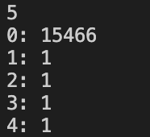

### Results
---
Overall, we were able to complete most of the goals we set out to, however we ran into some issues with the output of one of our algorithms
#### Our deliverables
   * Our makefiles run as expected
   * We properly read in our wikipedia set and built a graph based on it
   * We have thoroughly tested our graph and algorithms for bugs and memory leaks
   * 2 Wikipedia page input outputs page related to both results
   * 1 Wikipedia page recommendations are too large to be useful
   * See Kosaraju's algorithm for more details	 
#### Algorithms & Traversals
   * Dataset trimming
      * Trimmed dataset from 4 million nodes and 100 million edges to top 24 thousand with highest in-degree
      * Ran BFS on three seed nodes, terminated two steps from seed
      * Filtered out discarded nodes and output adjacency list to file in CSV format with 15.5 thousand nodes and about 952 thousand edges
   * Used Brandes Betweeness Centrality algorithm to determine the betweeness centrality of each wikipedia page in the trimmed dataset
      * Output placed in CSV that can be loaded into a map to avoid expensive algorithm cost 
      * Used the CSV to get related article for 2 page input	 
   * Used Kosaraju's Algorithm to find all of the strongly connected components in the trimmed dataset
    	* Consisted of first finding the DFS traversal of the graph, then running DFS again on the transpose of the original graph in the order of the original DFS
    	* Output resulted in nearly the all nodes being strongly connected (15.2k nodes)
    	* This algorithm was therefore unable to provide us with any useful recommendation since nearly the entire dataset is strongly connected. We had originally wanted to identify small clusters of strongly connected nodes that would theoretically be highly related to each other.
#### Verification Tests
We created our own testing .txt files for verifying the functionality of the BFS, Brandes, and Kosaraju's algorithms. These simple tests were constructions of adjacency lists that could mathematically be quickly verified for their expected outputs and were compared to how our code performed these algorithms. The testing files that were used can be found here: [Here](https://github.com/zayaanali/cs225-final-project/tree/main/tests)

#### Example Results:

**BFS**
The output of BFS was just the trimmed and parsed dataset files that were mentioned in the "Data Parsing and Trimming" section of the readme.md file, which is linked here: [Here](https://github.com/zayaanali/cs225-final-project/blob/main/readme.md)

**Brandes**

```
Top 6 nodes with highest betweenness centrality (all had centrality scores > 10,000,000)
* United States
* France
* United Kingdom
* World War II
* India
* New York City
```
```
Inputs: Skiing, Germany
Output: Alps, Norway, Snowboarding
```
```
Inputs: United States, Piano
Output: Western Culture, Country Music, Blues
```
```
Inputs: Clarinet, Leonard Bernstein
Output: Saxophone, Gustave Mahler, Benny Goodman
```

**Kosaraju's**
<br>

<br>
The number 5 describes the number of strongly connected components present in the graph. The number after for example "0:" which is 15466 describes how large the component is or what size it is.
